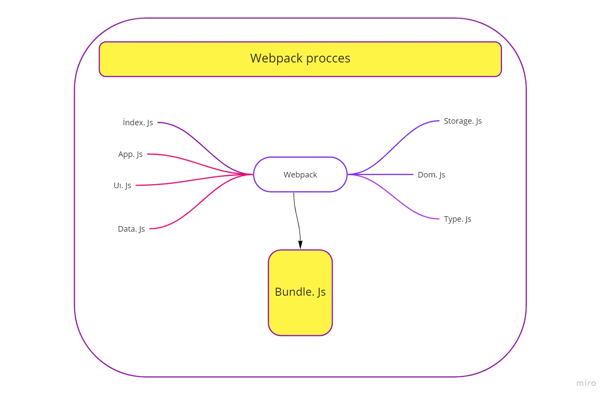
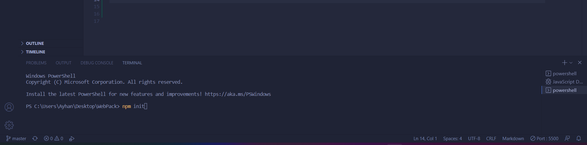
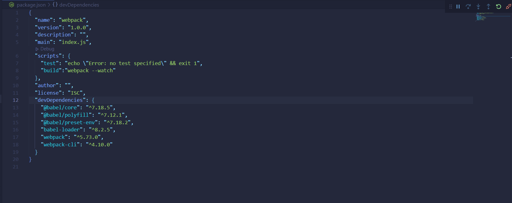
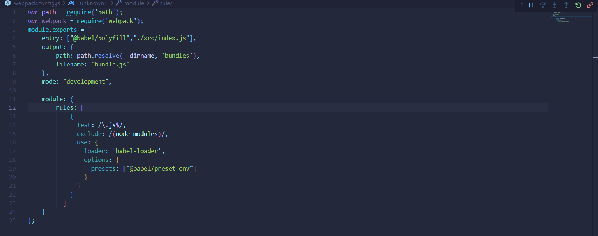
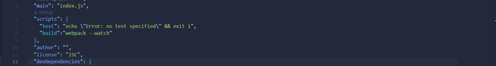
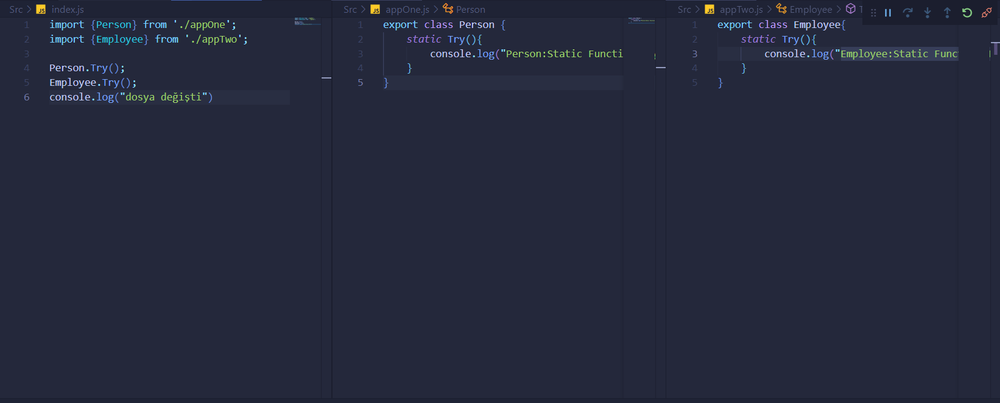
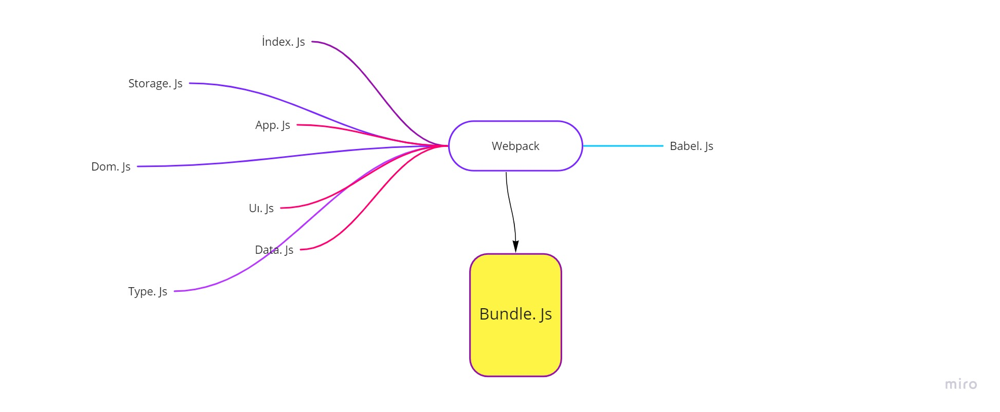
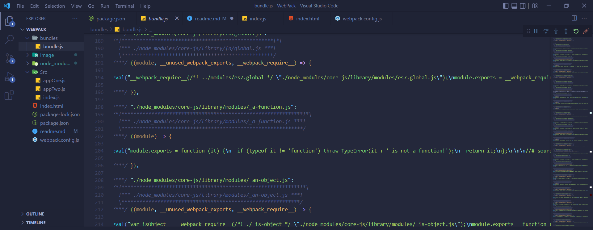
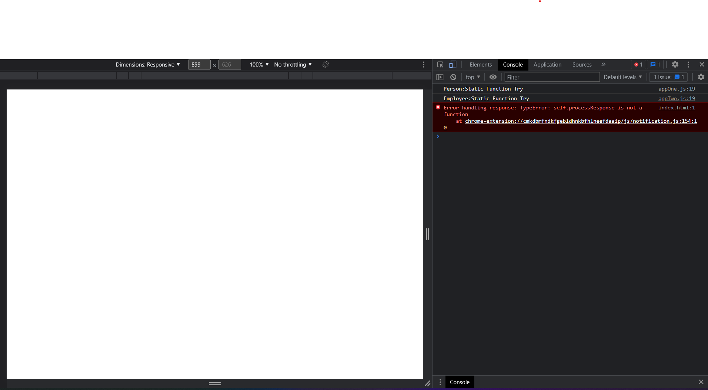

## WEBPACK PROCCES 

### Hello, in this article I will try to explain to you what is webpack in Javascript and what it does.



#### Webpack is a free and open-source module bundler for JavaScript. It is made primarily for JavaScript, but it can transform front-end assets such as HTML, CSS, and images if the corresponding loaders are included. Webpack takes modules with dependencies and generates static assets representing those modules.

#### The purpose of the Webpack package is to make a fast response to page loads and request. For example, if you have 10 or 20 js files in a web application, it would be very difficult and late to load and run all of them in the browser. User was annoyed by this situation Javascript developers created Webpack open source library as a solution to this problem. The purpose of this package is to reduce the number of 10 or 100 Javascript files to 1, ensuring easy and fast optimization of the page and user satisfaction.

## Installation and Operation Phases

#### 1 stage

```js
npm init 
```
#### Generate a package.json by typing "npm init" in the terminal .Then type the following codes into the terminal

```js
npm install webpack-cli webpack --save-dev
```
#### After downloading the webpack package into node_modules, web-pack should be downloaded in the package_json devDependencies object. and right after that we need to install babeljs.

```js
  npm install --save-dev @babel/core @babel/cli
```

#### and package_json final image should be


### The next step is to create a file named webpack.config.js and write the following codes in it.


### The next step is to come to the package_json file and work, the build key value in the scripts object should be build and its value should be as follows. '"build":"webpack --watch"'


### Now create src folder and create js files in it, then run them in index.js


### Now type npm run build in the terminal and run it. After that, bundles.js file will be created under the name of the bundles folder, and 3 js files will be formatted according to es5 standards, thanks to Babel, so that they can work in a single js file and in all browsers.




#### And Finish 



